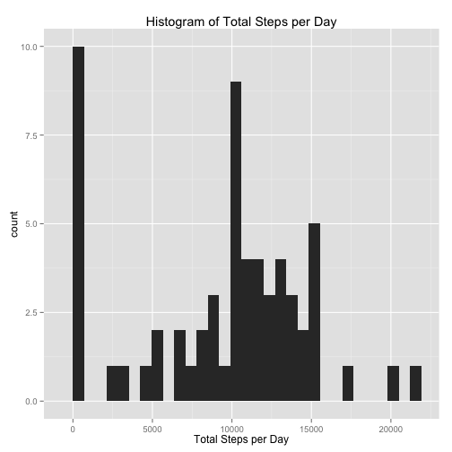
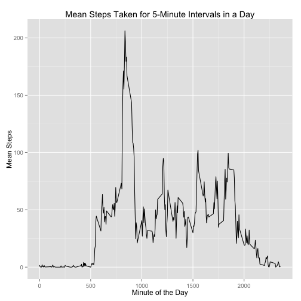
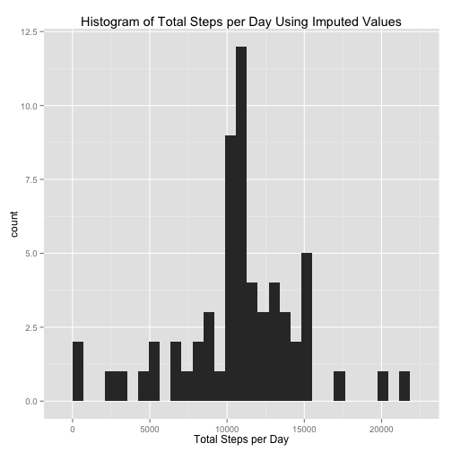
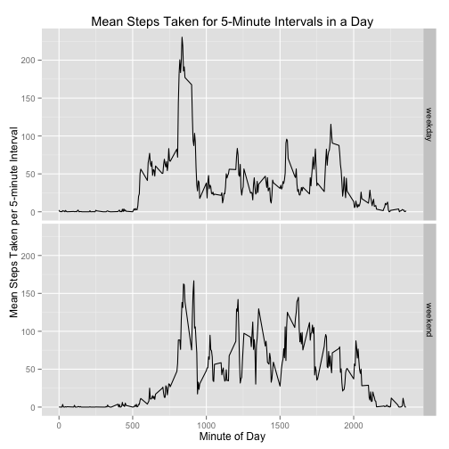

## Loading and preprocessing the data

Load the data:


```r
setwd("~/proj/2015/RepData_PeerAssessment1")
unzip("activity.zip")
data = read.csv("activity.csv")
```

Load libraries:


```r
library(dplyr)
library(ggplot2)
library(lubridate)
```


## What is mean total number of steps taken per day?

A histogram of the number of steps taken per day:


```r
## Summarize each day by the total number of steps, ignoring NA values
stepsPerDay = data %>% group_by(date) %>% summarize(steps=sum(steps, na.rm=TRUE))
## Plot a histogram of steps per day
ggplot(stepsPerDay, aes(x=steps)) + geom_histogram() + 
  labs(title="Histogram of Total Steps per Day", x="Total Steps per Day")
```

```
## stat_bin: binwidth defaulted to range/30. Use 'binwidth = x' to adjust this.
```

 

The mean total steps taken per day:

```r
mean(stepsPerDay$steps)
```

```
## [1] 9354.23
```

The median total steps taken per day:

```r
median(stepsPerDay$steps)
```

```
## [1] 10395
```


## What is the average daily activity pattern?

A plot of mean steps taken during each 5-minute interval of the day:


```r
meanStepsPerInterval = data %>% group_by(interval) %>% summarize(mean_steps=mean(steps, na.rm=TRUE))
ggplot(meanStepsPerInterval, aes(x=interval, y=mean_steps)) + geom_line() +
  labs(title="Mean Steps Taken for 5-Minute Intervals in a Day", x="Minute of the Day", y="Mean Steps")
```

 

The 5-minute interval with the highest average number of steps, averaged across days:


```r
filter(meanStepsPerInterval, mean_steps == max(mean_steps))$interval
```

```
## [1] 835
```


## Imputing missing values

Total missing values in the dataset:


```r
## Count the number of NAs, using the fact that, numerically, TRUE is 1 and FALSE is 0
sum(is.na(data$steps))
```

```
## [1] 2304
```

Confirm that there are no missing date or interval values:


```r
sum(is.na(data$date))
```

```
## [1] 0
```

```r
sum(is.na(data$interval))
```

```
## [1] 0
```

Missing values will be imputed using the following strategy: substitute an NA value for the mean number of steps in the corresponding 5-minute interval.

Create a new data set with imputed missing values:


```r
## add a column with the mean steps for each 5-minute interval
data2 = inner_join(data, meanStepsPerInterval, by="interval")
## fill NA values with the mean interval steps
filled_data = mutate(data2, filled_steps=ifelse(is.na(steps), mean_steps, steps))
```

Make a histogram of total steps taken each day, using imputed values:


```r
## Summarize each day by the total number of steps, using imputed data
filledStepsPerDay = filled_data %>% group_by(date) %>% summarize(steps=sum(filled_steps))
## Plot a histogram of steps per day
ggplot(filledStepsPerDay, aes(x=steps)) + geom_histogram() + 
  labs(title="Histogram of Total Steps per Day Using Imputed Values", x="Total Steps per Day")
```

```
## stat_bin: binwidth defaulted to range/30. Use 'binwidth = x' to adjust this.
```

 

Mean steps taken per day:


```r
mean(filledStepsPerDay$steps)
```

```
## [1] 10766.19
```

Median steps taken per day:


```r
median(filledStepsPerDay$steps)
```

```
## [1] 10766.19
```

What is the impact of imputing missing data on the estimates of the total daily number of steps?  Including the imputed values in the analysis has raised the mean and median values of the total steps per day.  This makes sense, considering that typically the imputed values are > 0, so including them will typically increase the total steps in a day.


## Are there differences in activity patterns between weekdays and weekends?

Create a new dataset with a factor variable indicating whether a day is a "weekday" or a "weekend":


```r
## add day_of_week and day_type (i.e. weekend, weekday) columns
day_data = mutate(filled_data, day_of_week=weekdays(ymd(date)), day_type=as.factor(ifelse(day_of_week %in% c("Saturday", "Sunday"), "weekend", "weekday")))
```

Make a panel plot containing a time series plot of the 5-minute interval (x-axis) and the average number of steps taken, averaged across all weekday days or weekend days (y-axis):


```r
meanStepsPerIntervalAndDayType = day_data %>% group_by(interval, day_type) %>% summarize(mean_filled_steps=mean(filled_steps))
ggplot(meanStepsPerIntervalAndDayType, aes(x=interval, y=mean_filled_steps)) +
  geom_line() + facet_grid(day_type ~ .) +
  labs(title="Mean Steps Taken for 5-Minute Intervals in a Day", 
       x="Minute of Day", y="Mean Steps Taken per 5-minute Interval")
```

 

